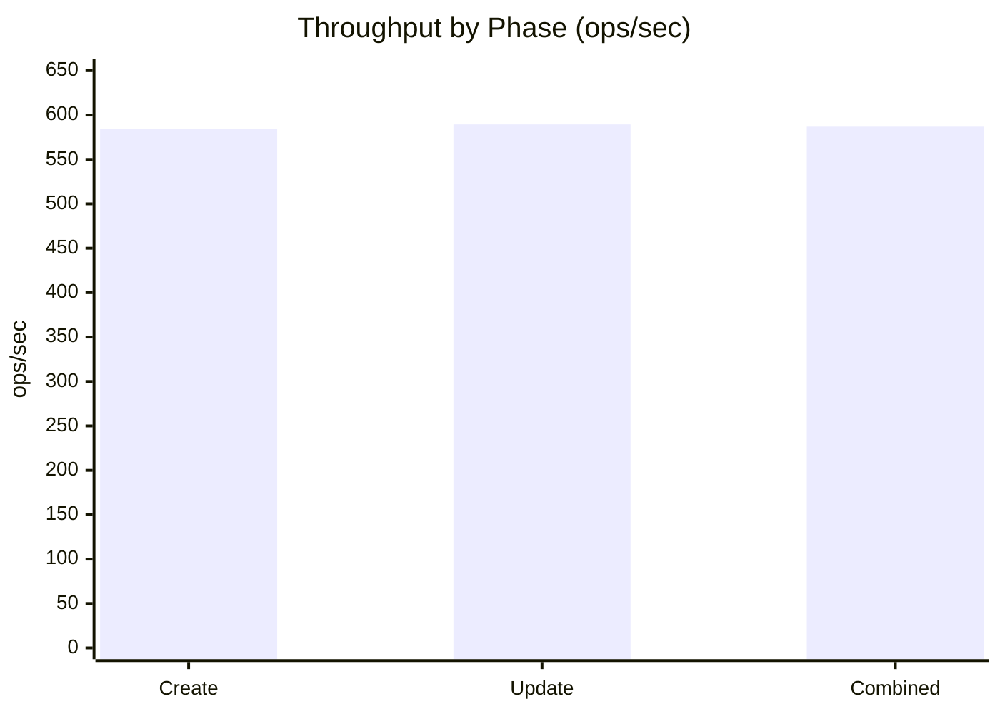
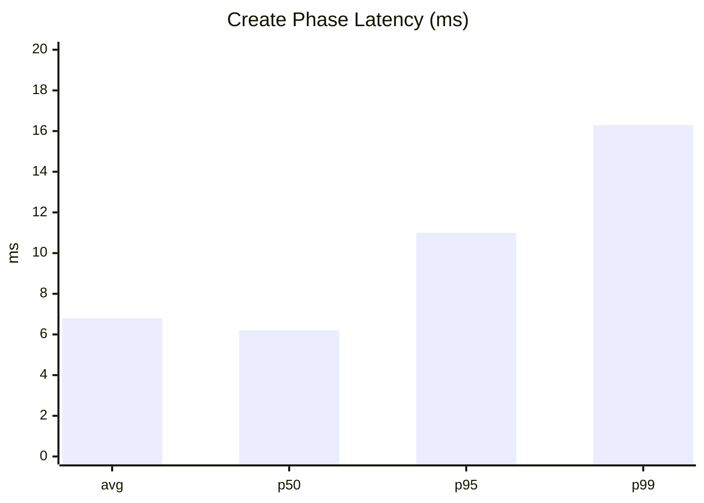
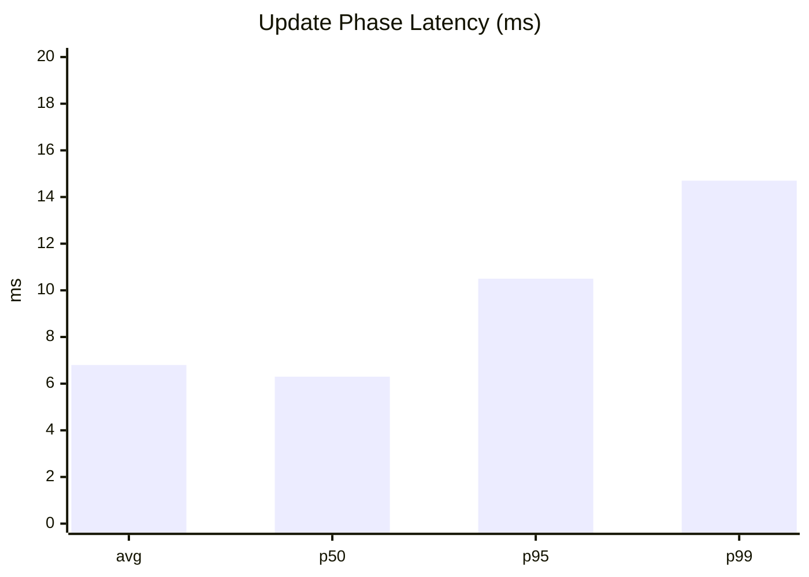

# KV-Store Benchmark Results

**Run date:** 2026-08-23  
**Target:** localhost:50052  
**Parallelism:** 4  
**Create / update duration:** 100 s each  
**Value size:** 64 bytes  

---

## Throughput (ops/sec)

| Phase | Throughput |
|-------|------------|
| Create | 584.42 |
| Update | 589.44 |
| Combined | 586.93 |

---

## Latency (ms)

| Phase | avg | p50 | p95 | p99 |
|-------|-----|-----|-----|-----|
| Create | 6.8 | 6.2 | 11.0 | 16.3 |
| Update | 6.8 | 6.3 | 10.5 | 14.7 |

---

## Operations

| Phase | Total | Success | Errors |
|-------|-------|---------|--------|
| Create | 58,444 | 58,444 | 0 |
| Update | 58,947 | 58,947 | 0 |
| **Combined** | **117,391** | **117,391** | **0** |

**Total time:** 200.0 s
