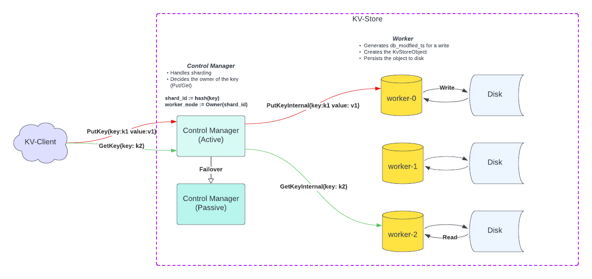

# KVStore

KVStore is a distributed key-value storage system designed with sharding, fault tolerance, and high availability in mind. It consists of two primary components:

**Control Manager**: Responsible for key sharding and routing.

**Worker Nodes**: Responsible for storage, retrieval, and persistence of key-value data.

This architecture supports minimal single points of failure by using active-passive control management with leader election via etcd.

---

## 🔧 Architecture Overview

## 📦 Components

---

### 1. 🧠 Control Manager

#### 🛠 Role

The Control Manager acts as the **central coordinator** for request routing and sharding logic.

- Uses a **hash-based algorithm** to generate a `shard_id` for each key.
- Maps the `shard_id` to a **worker node** responsible for managing that shard.
- Forwards `PUT` and `GET` operations to the appropriate worker node.

#### 🔁 High Availability

- Deployed in **Active/Passive** mode.
- **Leader election** is handled by `etcd`.
- Only the **active** Control Manager handles client requests.
- The **passive** node remains in standby and takes over if the active node fails.

#### 📌 Responsibilities

- 🔑 Hash key → Generate `shard_id`
- 🧭 `shard_id` → Determine owning worker node
- 📤 Forward client operations to workers
- 📩 Relay worker responses back to client

---

### 2. ⚙️ Worker Node

#### 🛠 Role

Each Worker Node is responsible for:

- Managing **one or more independent shards**
- **Persisting** key-value data to disk
- Responding to **read and write** requests forwarded by the Control Manager

---

#### 📝 Write Operation (`PUT`)

Upon receiving a write request from the Control Manager:

1. Generates a `db_modified_ts` (timestamp) using a **oracle timestamp for each shard**.
2. Constructs the **KV object** with key, value, and metadata {db_modified_ts}.
3. **Persists** the KV object to disk.
4. Sends the **response** back to the Control Manager.

---

#### 🔍 Read Operation (`GET`)

Upon receiving a read request:

1. Reads the **value from persistent storage**.
2. Sends the **retrieved value** back to the Control Manager.

## 🔌 RPC Overview

The **Control Manager** exposes two main RPCs to external KVStore clients:

### 🟢 External RPCs

- `PutKey`  
  Handles client write requests (key-value pairs).

- `GetKey`  
  Handles client read requests for a given key.

These RPCs are consumed by external clients interacting with the KVStore system.

---

### 🔁 Internal RPCs

For each external request, the Control Manager internally delegates to the appropriate **Worker Node** using the following RPCs:

- `PutKeyInternal`  
  Forwards the `PutKey` request to the worker node responsible for the key's shard. The worker handles write logic (timestamping, persistence).

- `GetKeyInternal`  
  Forwards the `GetKey` request to the owning worker node, which reads the value from disk and returns it.
---